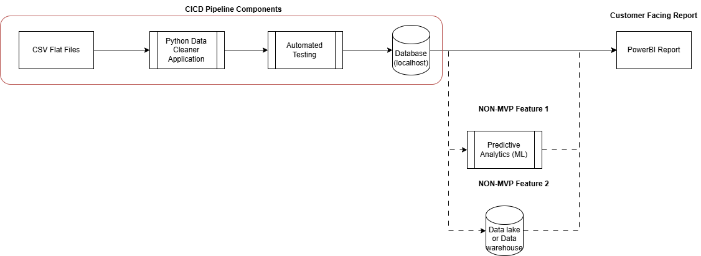

# Project Objectives

1. Set up GitHub Repo for project.
2. Design an architectural diagram for this pipeline.
3. Implement the python application that does the data cleaning.
4. Test the python application.
5. If there are no bugs, deploy our pipeline (CI/CD).
6. Trigger the pipeline to write to a databse.
7. Use the written data to create a PowerBI dashboard.

# Architecture Diagram

MVP Proposal for the architecture:

# Python experimentation

The initial python app was uploaded as a jupyter notebook to document the experimentation process and identify the cleaning steps needed.

Steps that will be needed:
- Get rid of rows with NaN values.
- Get rid of any duplicated rows.
- Change ID columns to Int datatype from float.
- Clean date columns and convert to datetime.
- Deal with invalid dates.
- Enrich date columns - calculating the difference between them.
- Store all removed records in a error dataframe with the type of error they have and whether it is actionable or not.

# Building the python app

The experiementation steps were then generalsised into functions and converted into a .py script that cleaned the data and then stored in a SQL Server database.

# Testing
 
A testing script was built to test the functionality of the date enrichment function, using unittest, to ensure:

- The cleaned and errors dataframes are the right length (based on the number of records that should be moved over to errors).
- All the remaining records in the clean dataframe have valid combinations (i.e. the book was returned after it was checked out), and vice versa for the error dataframe.
- The 'Loan Days' column was stored as an integer.
- All the 'Loan Days' values in the cleaned dataframe are greater than 0.

# CI/CD

CI/CD options were discussed but were out of scope for this project.

# Containerisation 

A Docker container was built that when spun up will install the necessary python packages and run the cleaner app, displaying the cleaned data in the terminal. (Future build: make the container store the output data in the SQL Server database)

# Visualisation

A PowerBI dashboard was built to display metrics of from the pipeline and give an overview of the cleaned data and also the errors that need to be rectified. Data is pulled from SSMS.